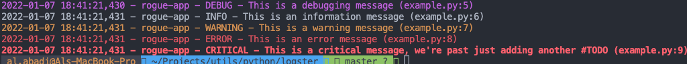

# logster - python logging made easy


### installation

```bash
python3 -m pip install logster
```
### usage
```python
from logster import setup_logger

logger = setup_logger(name="rogue-app", level="DEBUG")

logger.debug("This is a debugging message")
logger.info("This is an information message")
logger.warning("This is a warning message")
logger.error("This is an error message")
logger.critical("This is a critical message, we're past just adding another #TODO")

```



### credits

* Sergey Pleshakov: https://stackoverflow.com/a/56944256/8816796
